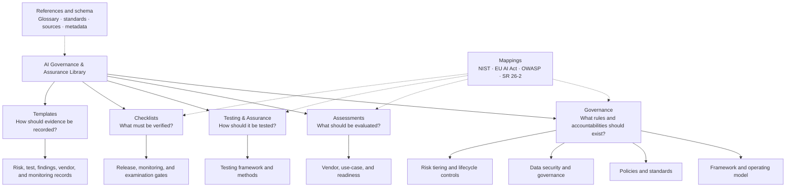

# AI Governance & Assurance Library

A practical, versioned collection of frameworks, procedures, checklists, templates, and reference material for governing and evaluating generative AI and agentic AI systems.

The library is organized by **artifact purpose**, then topic, then document. Regulations and standards are mapped across the library rather than used as the primary folder structure.

> **Release status:** Expanded curated draft (`0.2.0`). The material is implementation guidance, not legal advice, and must be tailored to an organization's risks, obligations, and operating environment.

## Repository taxonomy

The primary taxonomy is **artifact purpose → topic → document**. This keeps a policy, assessment, testing method, checklist, and template about the same topic distinct while allowing them to share metadata and regulatory mappings.

### Classification dimensions

| Dimension | Purpose | Examples |
|---|---|---|
| Artifact class | Primary folder and user question | `governance`, `assessment`, `testing`, `checklist`, `template` |
| Topic/domain | Subject addressed within an artifact class | security, privacy, model risk, agentic AI, third-party risk |
| Applies to | AI capability in scope | generative AI, LLM, RAG, agentic AI, machine learning |
| Lifecycle stage | Point at which the artifact is used | intake, design, validation, deployment, operation, retirement |
| Deployment | Technical delivery pattern | SaaS, API, on-premises, embedded, agentic workflow |
| Industry | Intended sector context | cross-industry, financial services, public sector |
| Status and version | Independent artifact lifecycle | draft, active, deprecated; semantic artifact version |

Regulatory mappings deliberately sit across the artifact classes. They help identify coverage and applicability but do not replace legal analysis or reorganize the library around individual regulations.

## Library

### Governance

| Resource | Description | Version | Status |
|---|---|---:|---|
| [AI Governance Framework](governance/ai-governance-framework.md) | Enterprise operating model, lifecycle, accountability, and control principles | 0.2.0 | Draft |
| [Roles and Decision Rights](governance/operating-model/roles-and-decision-rights.md) | Three-lines accountability, governance forums, RACI, and escalation | 0.1.0 | Draft |
| [AI Lifecycle Stage Gates](governance/lifecycle/stage-gates.md) | Entry, exit, evidence, and approval criteria from discovery through retirement | 0.1.0 | Draft |
| [AI Inventory Minimum Data Standard](governance/ai-inventory/minimum-data-standard.md) | Required system/use-case fields, ownership, reconciliation, and quality rules | 0.2.0 | Draft |
| [AI Data Security & Governance](governance/data-security-governance/README.md) | Integrated data lifecycle, classification, RAG/vector/agent security, and training/evaluation data standards | 0.1.0 | Draft |
| [Enterprise AI Control Objectives](governance/control-framework/control-objectives.md) | Testable governance, data, security, quality, vendor, agentic, and operations objectives | 0.2.0 | Draft |
| [GenAI Policy Suite](governance/policies/README.md) | Modular acceptable-use, data, model-risk, vendor, prompt, and change policies | 0.1.0 | Draft |
| [AI Risk Tiering Framework](governance/risk-tiering/ai-risk-tiering-framework.md) | Risk classification and minimum assurance requirements | 0.1.0 | Draft |

### Assessments

| Resource | Description | Version | Status |
|---|---|---:|---|
| [Vendor Assessment Framework](assessments/vendor-assessment/framework.md) | Risk-based assessment for AI and foundation-model vendors | 0.1.0 | Draft |
| [Vendor Questionnaire](assessments/vendor-assessment/questionnaire.md) | Evidence-oriented due-diligence questions | 0.1.0 | Draft |
| [Use-Case Assessment](assessments/use-case-assessment/checklist.md) | Intake and inherent-risk assessment | 0.1.0 | Draft |
| [Governance Readiness Assessment](assessments/readiness-assessment/checklist.md) | Governance, model-risk, privacy, and agentic-AI readiness | 0.1.0 | Draft |

### Testing & Assurance

| Resource | Description | Version | Status |
|---|---|---:|---|
| [Enterprise GenAI Testing](testing/testing-framework/enterprise-genai-testing.md) | Risk-based, modality-aware testing lifecycle | 0.1.0 | Draft |
| [Use-Case-Driven Test Design](testing/test-design/use-case-driven-test-design.md) | Test formats, query taxonomy, and coverage design | 0.1.0 | Draft |
| [Security Red Teaming](testing/security-red-teaming/testing-guide.md) | Adversarial testing for LLM and RAG applications | 0.1.0 | Draft |
| [Agentic AI Testing](testing/agentic-ai/testing-guide.md) | Tool-use, autonomy, memory, and multi-agent assurance | 0.1.0 | Draft |
| [Regression Testing](testing/regression-testing/testing-guide.md) | Change detection for provider and application updates | 0.1.0 | Draft |

Additional methodologies cover functional correctness, hallucination and factuality, safety, bias and fairness, privacy, and workflow integration in the [testing catalog](testing/README.md).

### Checklists & Templates

| Resource | Description | Version | Status |
|---|---|---:|---|
| [Examination Readiness](checklists/examination-readiness.md) | Control and evidence readiness for audit or examination | 0.1.0 | Draft |
| [Production Readiness](checklists/production-readiness.md) | Release gate for production AI systems | 0.1.0 | Draft |
| [Ongoing Monitoring](checklists/ongoing-monitoring.md) | Recurring quality, security, risk, and vendor checks | 0.1.0 | Draft |
| [Templates Catalog](templates/README.md) | Risk, testing, findings, vendor, and monitoring templates | 0.1.0 | Draft |

### Mappings & References

| Resource | Description | Reviewed |
|---|---|---:|
| [NIST AI RMF](mappings/nist-ai-rmf.md) | AI RMF 1.0 and Generative AI Profile mapping | 2026-08-17 |
| [SR 26-2](mappings/sr-26-2.md) | Current U.S. interagency model-risk guidance and GenAI scope note | 2026-08-17 |
| [EU AI Act](mappings/eu-ai-act.md) | Risk-based obligations and current application timeline | 2026-08-17 |
| [OWASP GenAI](mappings/owasp-genai.md) | OWASP Top 10 for LLM Applications 2026 mapping | 2026-08-17 |
| [Crosswalk](mappings/crosswalk.md) | Cross-framework control themes | 2026-08-17 |
| [Standards Landscape](references/standards-landscape.md) | Current standards and guidance register | 2026-08-18 |
| [Source Coverage Map](references/source-coverage-map.md) | Traceability from supplied source sections to curated library artifacts | 2026-08-18 |

## How to use the library

1. Classify the proposed AI use case using the [risk-tiering framework](governance/risk-tiering/ai-risk-tiering-framework.md).
2. Complete the [use-case](assessments/use-case-assessment/checklist.md) and, when applicable, [vendor assessment](assessments/vendor-assessment/framework.md).
3. Select testing methods based on risks, deployment modality, and lifecycle stage.
4. Use the checklists as release and monitoring gates.
5. Record decisions and evidence using the templates.
6. Use mappings to identify relevant obligations; confirm legal applicability independently.

## Versioning and metadata

Each substantive artifact carries YAML front matter with a stable identifier, controlled taxonomy, status, version, and review date. See the [metadata standard](schema/metadata.md). Artifact versions evolve independently; repository releases represent curated library snapshots.

## Contributing

See [CONTRIBUTING.md](CONTRIBUTING.md) for editorial standards, review requirements, and the definition of a material change.

## License

Except where a file states otherwise, this library is licensed under [Creative Commons Attribution 4.0 International](LICENSE).
